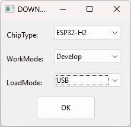
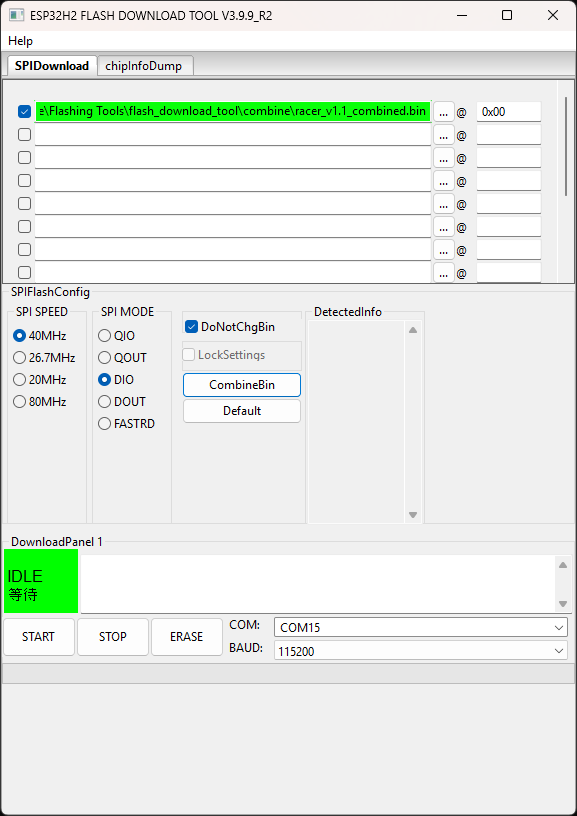

# Micro Racer Flashing Guide

## Navigation
- [Home](README.md) | [Quick Start](QuickStart.md) | [Micro Racer Assembly](RacerAssembly.md) | [Thumbtroller Assembly](ThumbtrollerAssembly.md) | [Flashing Guide](FlashingGuide.md)

---

This guide will walk you through flashing firmware to your Micro Racer using the Espressif Flash Download Tool.

## Prerequisites

- Download the Espressif `Flash Download Tool` from [Espressif Documentation](https://docs.espressif.com/projects/esp-test-tools/en/latest/esp32/production_stage/tools/flash_download_tool.html)
- Download the latest Micro Racer firmware from [GitHub Releases](https://github.com/StuckAtPrototype/Racer/releases/tag/fw_v_1_1)
- USB-C cable to connect your Micro Racer to your PC

## Step-by-Step Flashing Process

### 1. Launch the Flash Download Tool

1. Open the Espressif Flash Download Tool
2. In the tool interface, configure the following settings:
   - **Chip Type**: Select `ESP32H2`
   - **WorkMode**: Select `Develop`
   - **LoadMode**: Select `USB`

### 2. Configure the Firmware File

1. Click the `...` button next to the file path field
2. Navigate to and select your firmware file (.bin file)
3. Set the **address** to `0x0` (zero x zero)
4. Ensure the file path and address are correctly displayed

### 3. Prepare Your Micro Racer

1. **Ensure the battery is connected** to your Micro Racer
2. **Switch the car to ON** position
3. Connect your Micro Racer to your PC using a USB-C cable
4. **Important**: If the connection doesn't work initially, try flipping the USB-C connector - sometimes the orientation matters
5. Wait for Windows to recognize the device and install drivers if needed

### 4. Select the COM Port

1. In the Flash Download Tool, look for the COM port dropdown
2. Find the COM port that your Micro Racer enumerated to (it will typically show as a new COM port when connected)
3. Select the correct COM port from the dropdown menu

### 5. Flash the Firmware

1. Double-check all settings:
   - Chip Type: ESP32H2
   - Correct firmware file selected
   - Address set to 0x0
   - Correct COM port selected

2. Click the **Start** button to begin the flashing process

3. Wait for the flashing process to complete - you should see progress indicators and success messages
4. **Important**: When the flashing tool shows "Finished", you need to restart your Micro Racer by toggling the power switch OFF and then back ON

## Troubleshooting

- **Connection Issues**: Try flipping the USB-C connector if the device isn't recognized
- **Wrong COM Port**: Check Device Manager in Windows to see which COM port the device is using
- **Flash Fails**: Ensure the Micro Racer is in the correct mode and try disconnecting/reconnecting the USB cable
- **Driver Issues**: Make sure you have the latest USB drivers installed for your system

## Success

Once flashing is complete and the tool shows "Finished":

1. **Restart your Micro Racer** by toggling the power switch OFF and then back ON
2. Disconnect the USB cable
3. Your Micro Racer should now be running the new firmware and ready to use

