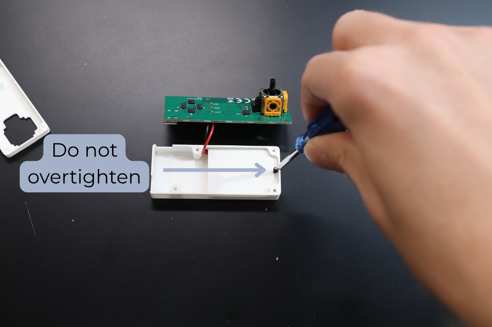
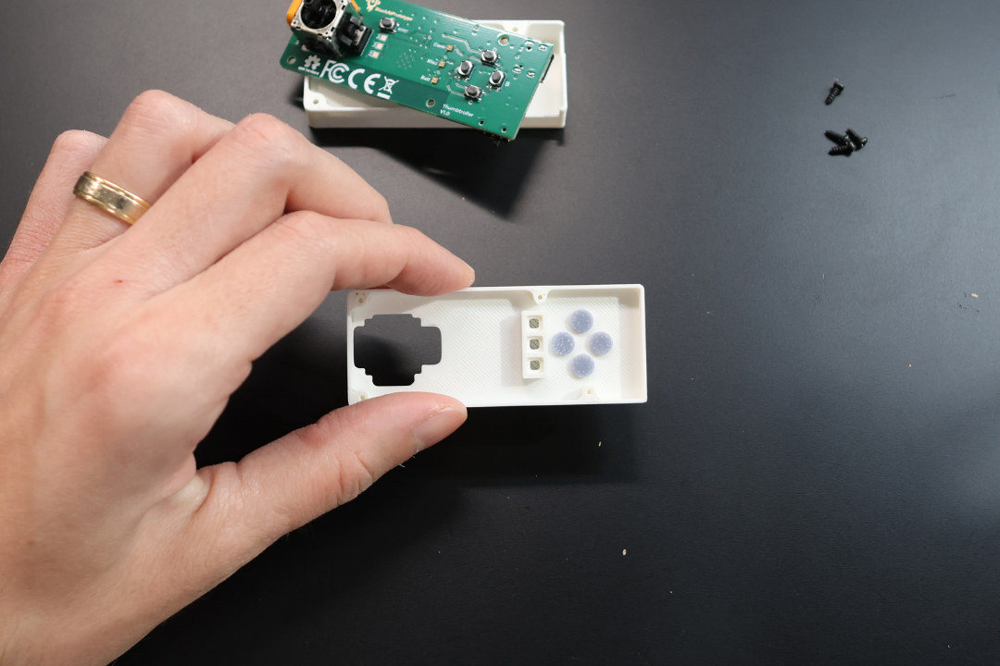
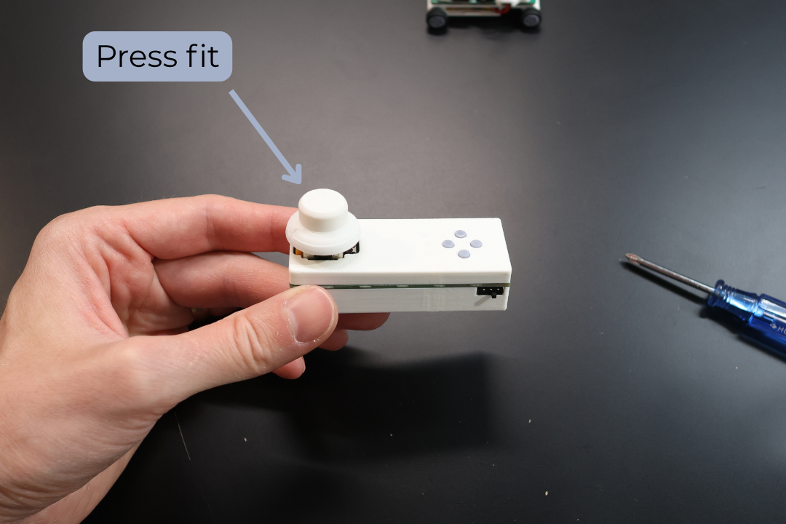

# Thumbtroller Assembly Procedure

## Navigation
- [Home](README.md) | [Quick Start](QuickStart.md) | [Micro Racer Assembly](RacerAssembly.md) | [Thumbtroller Assembly](ThumbtrollerAssembly.md)

---

### ⚠️ Safety Warning
**Electrostatic sensitive components.** Please ensure proper grounding before handling.

### What You Need

#### Tools
- Phillips screwdriver

#### From the Kit
- 1x Thumbtroller PCB
- 1x Bottom Enclosure
- 1x Top Enclosure
- 1x Battery Holder
- 1x Thumb Cap
- 1x LiPo Battery
- 4x Button Cap
- 5x Self-tapping screw

### Assembly Steps

#### Step 1: Install Battery
Take the 300mAh LiPo Battery provided in the set. Ensure the RED lead is aligned with the (+) on the board. Plug it into the Thumbtroller PCB.

#### Step 2: Position Battery
Place the battery into the Bottom Enclosure as pictured.

#### Step 3: Secure Battery
Secure the battery with 1x self tapping screw ensuring the battery wires are not pinched.

> **NOTE:** Do not overtighten

#### Step 4: Position PCB
Position the Thumbtroller PCB into position.

#### Step 5: Install Button Caps
Insert the 4x Button Caps into the Top Enclosure as pictured.

#### Step 6: Align Enclosures
Carefully flip the Bottom Enclosure together with the PCB onto the Top Enclosure making sure to align the screw holes.

#### Step 7: Secure Enclosures
Carefully secure the enclosures with 4x self tapping screws.

> **NOTE:** Do not overtighten.

#### Step 8: Install Thumb Cap
Place the Thumb Cap onto the joystick.

## Done! Congrats, you can now use your Thumbtroller. 
You can find the Instructions Manual [here](Manual.md)